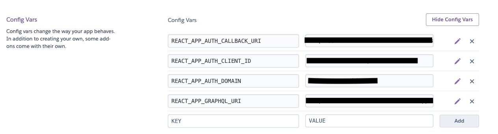

# Todo App

A todo app built using React and Hasura GraphQL Engine.

Features:
1. Users can create account (using Auth0)
2. Authenticated users can create, delete todo.
3. Authenticated users can see all of their created todos.

## Try the app
[Click here](https://todo-with-react-hasura.herokuapp.com/)

## Set up your own app

1. Clone this repo `https://github.com/ashishra0/react-hasura-todo.git`
2. Install the dependencies using `npm install`.

3. Deploy your Hasura GraphQL Server using [Click To Deploy](https://heroku.com/deploy?template=https://github.com/hasura/graphql-engine-heroku).

4. Create a table named `todos` with following fields
    - id: integer (auto increment)
    - text: Text
    - completed: Boolean
    - user: Text
    - Select id as Primary Key.

5. For Hasura and Auth0 configuration follow the steps in this [video](https://www.youtube.com/watch?v=kHCLQEKjdnI).

Create a .env file and include add the following data in it.
```
REACT_APP_CLIENTID='<Auth0 client ID>'
REACT_APP_AUTH_CALLBACK_URI='<Callback URI>'
REACT_APP_AUTH_DOMAIN='<Auth0 domain>'
REACT_APP_GRAPHQL_URI='<Hasura GraphQL Server Endpoint>'
```
## Configuring React on Heroku
Go to the settings > Config vars in your Heroku React dashboard
and add the following:



## Tech stack

- ReactJS
- Hasura GraphQL Engine
- Auth0
- Apollo Client

## Running the app
- `npm start` The app should automatically load in the browser on `localhost:3000`
---

If you run into some errors feel free to open a issue.


